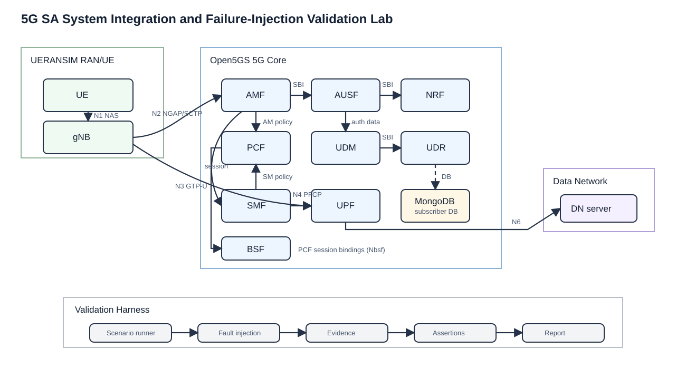

# open5gs-ueransim-5g-sa-lab


Open5GS + UERANSIM 5G Standalone lab for demonstrating practical 5G Core/RAN integration, Linux networking, Docker-based lab operations, and Python log analysis.

The project is built as a telecom engineering portfolio artifact, not a copy-paste tutorial. It includes core and RAN simulator configs, subscriber provisioning notes, startup/stop scripts, traffic validation, log collection, parser output, notebook analysis, diagrams, reports, and troubleshooting guidance.

This repository is intentionally honest: sample logs are labeled as samples, runtime outputs must be replaced with evidence from a Linux host, and Docker/SCTP/TUN limitations are documented.

## Validation Status

- Current status: Docker Compose syntax, parser execution, shell syntax, and notebook JSON have been validated locally with sample logs.
- Full Linux runtime validation: pending until a real evidence folder such as `evidence/real_run_YYYYMMDD/` is added from an Ubuntu host/VM.
- Do not claim that the full Open5GS/UERANSIM lab has executed successfully until real logs, screenshots, parser output, and traffic results are collected.
- Container image entrypoints and `open5gs-dbctl` command syntax can vary by image version. Treat the Compose file as a runnable lab definition that must be confirmed on the target Linux host.

## Project Value

This lab is designed for portfolio review by telecom hiring managers evaluating candidates for:

- 5G/RAN Engineer
- 5G Core / Lab Engineer
- RF & Wireless Test Engineer
- Telecom Systems Engineer
- Network Integration Engineer
- Technical Support Engineer for wireless systems

It connects RAN KPI troubleshooting experience with the 5G Core procedures behind UE registration, authentication, security mode, PDU session establishment, and user-plane validation.

Professional profile relevance:

- 5G/LTE RAN experience and KPI troubleshooting mindset.
- Huawei/ZTE network operations background applied to lab validation.
- 5G testbed and containerized lab practice.
- Linux networking, SCTP/TUN, routing, and Docker troubleshooting.
- Python log parsing and notebook-based technical analysis.
- RF/material characterization background as complementary evidence discipline, not as a claim that this simulator reproduces RF behavior.

## What This Demonstrates

- Understanding of 5G SA control-plane and user-plane procedures.
- Ability to configure AMF, SMF, UPF, NRF, gNB, UE, DNN, PLMN, TAC, and S-NSSAI consistently.
- Awareness of practical lab constraints such as SCTP, TUN interfaces, Docker networking, and UPF/N6 routing.
- Evidence-oriented troubleshooting with logs, parser output, reports, and a validation checklist.
- Professional documentation discipline: clear assumptions, limitations, and next validation steps.

## Architecture



Mermaid source: [diagrams/5g_sa_lab_architecture.md](diagrams/5g_sa_lab_architecture.md)

Core interfaces:

- N1: UE NAS signaling via gNB.
- N2: gNB to AMF using NGAP over SCTP.
- N3: gNB to UPF using GTP-U.
- N4: SMF to UPF using PFCP.
- N6: UPF to data network.
- SBI: AMF/SMF/NRF service communication.

## Tech Stack

- Docker Compose
- Open5GS AMF, SMF, UPF, NRF
- MongoDB subscriber database
- UERANSIM gNB and UE
- Python 3 standard library parser
- Jupyter Notebook for session timeline analysis
- Markdown reports and Mermaid/SVG diagrams

## Repository Structure

```text
.
├── README.md
├── LICENSE
├── docker-compose.yml
├── configs/
│   ├── open5gs/
│   ├── ueransim/
│   └── subscriber_config.yaml
├── scripts/
├── notebooks/
├── reports/
├── logs/
├── diagrams/
├── evidence/
└── docs/
```

## Prerequisites

Use an Ubuntu Linux host or VM for real validation.

```bash
docker version
docker compose version
python3 --version
ls -l /dev/net/tun
sudo modprobe sctp || true
```

macOS is fine for editing, documentation, and parser/notebook work. Real UE tunnel and SCTP validation should be done on Linux because Docker Desktop may not expose the needed kernel behavior.

## Quick Start

Use this sequence on Ubuntu/Linux for runtime validation. On macOS, use it for documentation/parser review only unless you have verified SCTP and TUN behavior in your environment.

```bash
chmod +x scripts/*.sh scripts/parse_attach_logs.py
./scripts/start_lab.sh
./scripts/add_subscriber.sh
docker compose --profile ran up -d gnb ue
docker compose logs -f gnb ue amf smf
./scripts/traffic_test.sh
./scripts/collect_logs.sh
python3 scripts/parse_attach_logs.py logs/*sample.txt -o logs/parsed_attach_events.csv
python3 scripts/parse_attach_logs.py logs/*sample.txt -o logs/parsed_attach_events.json --json
```

For sample-only parser validation without starting containers:

```bash
python3 scripts/parse_attach_logs.py logs/*sample.txt -o logs/parsed_attach_events.csv
python3 scripts/parse_attach_logs.py logs/*sample.txt -o logs/parsed_attach_events.json --json
```

## Step-by-Step Setup

Start the 5G Core:

```bash
./scripts/start_lab.sh
docker compose ps
```

Provision the subscriber:

```bash
./scripts/add_subscriber.sh
```

The script attempts to use `gradiant/open5gs-dbctl`. If the helper syntax differs in your Open5GS packaging version, it prints a manual WebUI method. Use these lab-only values:

| Field | Value |
|---|---|
| SUPI | `imsi-001010000000001` |
| K | `465B5CE8B199B49FAA5F0A2EE238A6BC` |
| OPc | `E8ED289DEBA952E4283B54E88E6183CA` |
| AMF | `8000` |
| DNN | `internet` |
| S-NSSAI | SST `1`, SD `000001` |

Start gNB and UE:

```bash
docker compose --profile ran up -d gnb ue
docker compose logs -f gnb ue amf smf upf
```

Validate registration:

```bash
docker compose logs --no-color amf gnb ue | grep -Ei "NG Setup|Registration|Authentication|Security"
```

Validate PDU session:

```bash
docker compose logs --no-color smf ue | grep -Ei "PDU|uesimtun|IPv4|DNN"
docker compose exec ue ip addr
```

Run traffic test:

```bash
./scripts/traffic_test.sh
cat logs/traffic_test_result.txt
```

Collect logs:

```bash
./scripts/collect_logs.sh
```

Parse sample logs:

```bash
python3 scripts/parse_attach_logs.py logs/*sample.txt -o logs/parsed_attach_events.csv
python3 scripts/parse_attach_logs.py logs/*sample.txt -o logs/parsed_attach_events.json --json
```

Parse real collected logs:

```bash
python3 scripts/parse_attach_logs.py logs/20260621T*/amf.log logs/20260621T*/smf.log logs/20260621T*/gnb.log logs/20260621T*/ue.log -o logs/parsed_attach_events.csv
```

Open the notebook:

```bash
jupyter lab notebooks/session_establishment_analysis.ipynb
```

## Example Parser Output

Expected sample command:

```bash
python3 scripts/parse_attach_logs.py logs/*sample.txt -o logs/parsed_attach_events.csv
```

Expected output format:

```text
Parsed <N> events -> logs/parsed_attach_events.csv
event_count: <N>
unclassified_relevant_count: <N>
error_or_warning_count: <N>
missing_events: []
registration_duration_ms: <value>
authentication_duration_ms: <value>
pdu_session_establishment_duration_ms: <value>
```

The CSV includes `timestamp`, `component`, `event`, `severity`, `source_file`, `line_number`, and `raw_line`. `unclassified_relevant` rows are NAS/NGAP/PFCP/GTP/DNN/NSSAI/SUPI lines that the parser could not safely classify into a known procedure stage.

These are sample-log outputs only until you run the lab and parse real logs.

## Reports

- [Latency report](reports/latency_report.md)
- [Session establishment analysis](reports/session_establishment_analysis.md)
- [Troubleshooting notes](reports/troubleshooting_notes.md)
- [Technical background](docs/technical_background.md)
- [Validation checklist](docs/validation_checklist.md)
- [Real-run evidence guide](docs/real_run_evidence_guide.md)
- [Evidence folder guidance](evidence/README.md)

## Next Step: Linux Runtime Evidence

The next engineering milestone is to run the full lab on Ubuntu and add curated evidence under `evidence/real_run_YYYYMMDD/`.

Minimum evidence before calling the lab fully validated:

- `docker compose ps` showing MongoDB, NRF, AMF, SMF, UPF, gNB, and UE.
- AMF/gNB logs showing NG setup.
- UE/AMF logs showing registration, authentication, security mode, and registration complete.
- SMF/UE logs showing PDU session establishment or a clearly documented failure.
- UE tunnel/interface output.
- Traffic test result.
- Parser CSV/JSON generated from real logs.
- Updated reports with real host, version, timing, and traffic evidence.

## Limitations

- UERANSIM simulates UE/gNB behavior; it is not RF validation.
- Docker Desktop may fail around SCTP, TUN, or user-plane routing.
- Container image command syntax can change; scripts expose assumptions.
- UERANSIM/Open5GS container images are community-packaged here; verify entrypoints and binary paths on the execution host before calling the project fully validated.
- Ping latency is not commercial RAN latency.
- UPF N6 NAT/routing may need host-specific adjustment depending on image behavior and Docker bridge policy.
- Prometheus/Grafana are not included because the base lab should remain stable and focused.

## Troubleshooting

Start with:

```bash
docker compose ps
docker compose logs -f amf smf upf gnb ue
python3 scripts/parse_attach_logs.py logs/*sample.txt
```

Then use [reports/troubleshooting_notes.md](reports/troubleshooting_notes.md) for symptom-based fixes.

## Future Improvements

- Pin image versions after confirming tags on the execution host.
- Add CI checks for YAML and parser tests.
- Add optional Prometheus/Grafana only after stable metrics endpoints are confirmed.
- Add packet-capture workflow for NGAP/GTP-U on a Linux host.
- Add multi-UE scenarios and slice/DNN negative tests.
- Add measured reports from a real Ubuntu run.

## Skills Demonstrated

- 5G SA registration and PDU session troubleshooting.
- AMF/SMF/UPF role understanding.
- RAN-to-core integration via N2/N3.
- Docker Compose lab automation.
- Linux network debugging.
- Subscriber, DNN, PLMN, and S-NSSAI consistency checks.
- Evidence collection and technical reporting.
- Python parsing of protocol logs into structured outputs.

## References

- [Open5GS documentation](https://open5gs.org/open5gs/docs/)
- [gradiant/open5gs container image](https://hub.docker.com/r/gradiant/open5gs)
- [gradiant/ueransim container image](https://hub.docker.com/r/gradiant/ueransim)
- [Open5GS and UERANSIM Gradiant chart demo](https://gradiant.github.io/5g-charts/open5gs-ueransim-gnb.html)

## German Hiring Relevance

This project is designed for telecom hiring managers looking for practical engineering evidence. It shows that the candidate can move between RAN KPIs, 5G Core procedures, lab setup, logs, Linux commands, and clear documentation. The emphasis is reproducibility and troubleshooting discipline, which maps directly to integration, validation, field support, and test-lab roles in German telecom environments.
