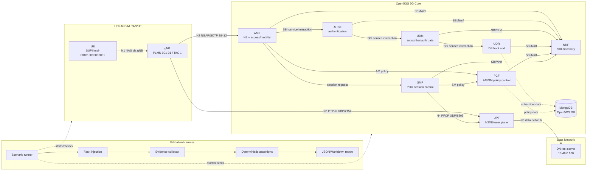

# 5G SA Lab Architecture

GitHub renders the Mermaid diagram below directly in Markdown.

Interface notes:

- N1: UE NAS signaling carried through the gNB; NAS terminates at AMF.
- N2: gNB to AMF control plane using NGAP over SCTP.
- N3: gNB to UPF user plane using GTP-U.
- N4: SMF to UPF control using PFCP.
- N6: UPF to internal data-network test target.
- SBI: Open5GS service-based interfaces for NF discovery and core service interaction.
- PCF/NSSF mode: PCF is present for Open5GS 2.8.0 policy associations; NSSF is omitted because matching `smf.info` enables direct NRF-based SMF selection.
