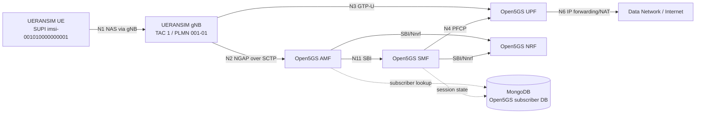

# 5G SA Lab Architecture

GitHub renders the Mermaid diagram below directly in Markdown.

Interface notes:

- N1: UE NAS signaling carried through the gNB.
- N2: gNB to AMF control plane using NGAP over SCTP.
- N3: gNB to UPF user plane using GTP-U.
- N4: SMF to UPF control using PFCP.
- N6: UPF to data network.

